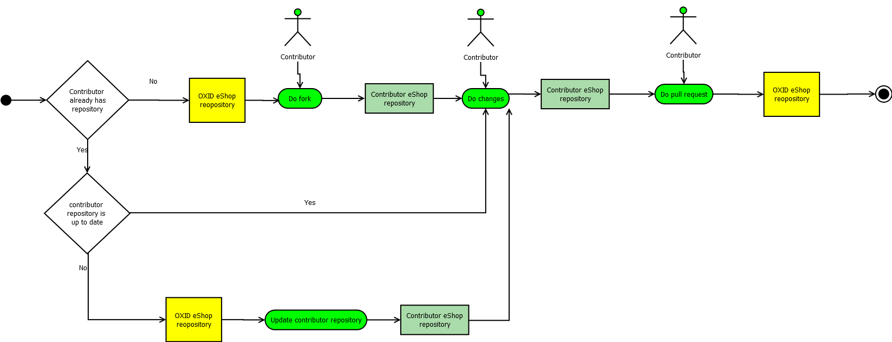

Contributing to OXID eShop
==========================

OXID eShop is available under two different licenses, OXID Community License and a commercial license.

We warmly welcome everybody who would like to contribute!

.. note::
   Before contributing for the first time, you must sign the Contributor License Agreement.
   The CLA assistant will automatically prompt you when you create your first pull request.
   See the :ref:`contributor-agreement` section at the end of this document for details.

Types of Contributions
----------------------

Bug Fixes and Small Improvements
^^^^^^^^^^^^^^^^^^^^^^^^^^^^^^^^

* Create a pull request to the appropriate branch (see branching strategy below)
* Ensure GitHub workflow checks pass
* Add tests for your bug fix
* Check the `bugtracker <https://bugs.oxid-esales.com/>`_ and mention bug numbers in your PR description

New Features
^^^^^^^^^^^^

New features require coordination before being merged:

* `Quality requirements <development/modules_components_themes/quality.html#code-quality-requirements>`_ must be met
* The feature must be coordinated with OXID

**For all contributors:**

* Feature requests should be sent to Produktmanagement@oxid-esales.com
* Popular features may be added to our backlog
* Consider implementing as a separate module first
* Partners can use the `contact form <https://www.oxid-esales.com/en/contact-us/>`_ for detailed discussions

Pull Request Process
--------------------

Branch Naming Strategy
^^^^^^^^^^^^^^^^^^^^^^

Understanding OXID versioning:

* **Components**: Individual parts with semantic versioning
* **Compilation**: Bundle of core + essential modules

Branch types in the repository:

* ``b-{next major}.x.x`` - Next major version (new features, breaking changes, bug fixes)
* ``b-{current major}.{next minor}.x`` - Next minor version (backwards compatible changes)
* ``b-{current major}.{current minor}.x`` - Current patch branch (bug fixes only)
* ``b-{current major}.{previous minor}.x`` - Previous patch branch (critical fixes only)

Finding the Right Branch
^^^^^^^^^^^^^^^^^^^^^^^^

* **Security issues**: Follow `security procedures <https://docs.oxid-esales.com/en/security/security.html>`_ - do not create PRs
* **Database changes or breaking compatibility**: Next major version branch
* **Small improvements (non-breaking)**: Next minor version branch
* **Bug fixes (non-breaking)**: Current patch version branch

Development Workflow
--------------------

Setting Up Development Environment
^^^^^^^^^^^^^^^^^^^^^^^^^^^^^^^^^^

We recommend using our Docker-based:

* `SDK <https://github.com/OXID-eSales/docker-eshop-sdk>`_
* `Recipes <https://github.com/OXID-eSales/docker-eshop-sdk-recipes>`_

Best Practices
^^^^^^^^^^^^^^

1. Install the shop using SDK and recipes
2. Register your fork as a git remote
3. Create a descriptive branch name (e.g., ``b-8.x.x-feature_foo`` or ``b-8.x.x-bug_bugname``)
4. Make your changes and push to your fork
5. Create a pull request with:
   
   * Clear, detailed description of changes
   * Screenshots if applicable
   * Reference to related issues

6. Additional commits can be added to update the PR

For more details, see: http://codeinthehole.com/writing/pull-requests-and-other-good-practices-for-teams-using-github/

After creating your pull request, the CLA assistant will automatically ask you to sign the Contributor Agreement if you haven't already. We'll then review your code and inform you of the decision.

Code Quality
------------

Please follow our guidelines for:

* Development tools
* Coding style
* Code quality standards

See the :doc:`development/modules_components_themes/quality` documentation for details.

Technical Resources
-------------------

For help with Git and GitHub: https://help.github.com/

.. _contributor-agreement:

Contributor Agreement
---------------------

Before your first contribution, you must `sign the Contributor License Agreement <https://cla-assistant.io/OXID-eSales/oxideshop_ce>`_.

Contributor Agreement FAQ
^^^^^^^^^^^^^^^^^^^^^^^^^

What should I do before I contribute code to OXID eShop?
^^^^^^^^^^^^^^^^^^^^^^^^^^^^^^^^^^^^^^^^^^^^^^^^^^^^^^^^

We recommend that you take a few simple steps before you spent time extending the OXID eShop:

* Read this entire documentation
* Review the existing feature set to avoid duplicating functionality
* Subscribe to the OXID Dev Slack Channel (oxid-dev.slack.com)
* Discuss the feature you'd like to build on the list

Do I need to sign anything to get started?
^^^^^^^^^^^^^^^^^^^^^^^^^^^^^^^^^^^^^^^^^^

Yes, you must sign the OXID eSales Contributor Agreement (OXID-CA) electronically before your first contribution. This is done automatically when you create your first pull request.

When do I need to fill out a contributor agreement?
^^^^^^^^^^^^^^^^^^^^^^^^^^^^^^^^^^^^^^^^^^^^^^^^^^^

Before the first time that you contribute source code or other materials like documentation, design specs, bug fixes, or graphics to OXID eShop.

What if I'm contributing on behalf of my company?
^^^^^^^^^^^^^^^^^^^^^^^^^^^^^^^^^^^^^^^^^^^^^^^^^

In that case, an officer of your company (usually a VP or higher title) must sign the OXID-CA on behalf of the company, indicating his or her title.

The company can choose to list the specific individuals authorized to make contributions on the "Full Name" line, or may cover all employees with a blanket OXID-CA by not limiting contributors to an authorized list.

Why do you have a Contributor Agreement?
^^^^^^^^^^^^^^^^^^^^^^^^^^^^^^^^^^^^^^^^

The contributor agreement has two key purposes:

* enabling multiple business models around OXID eShop
* protecting the OXID eShop community

On the business front, the OXID-CA allows OXID eSales to maintain a dual-licensing business model and allows contributors to pursue similar models with their contributions.

On the community front, the OXID-CA allows OXID eSales AG to act as stewards of the OXID codebase and supporting materials, holding copyright on these resources on behalf of the OXID eShop community.

What does the OXID-CA do?
^^^^^^^^^^^^^^^^^^^^^^^^^

By executing an OXID-CA, you:

* share your copyrights with OXID eSales AG
* license any patents relevant to your contributions to OXID eSales AG
* assert that your contributions are original works
* assert that you are legally entitled to grant OXID eSales AG these rights
* assert that your contributions do not violate anyone else's rights

By accepting an OXID-CA, OXID eSales promises that your contributions will always be distributed under Free Culture or Free Software/Open Source licenses.

Are Contributor Agreements such as this one common?
^^^^^^^^^^^^^^^^^^^^^^^^^^^^^^^^^^^^^^^^^^^^^^^^^^^

Yes. Many other open-source communities and projects have contributor agreements, including the Free Software Foundation, the Apache Software Foundation, the Eclipse Foundation, and many more.