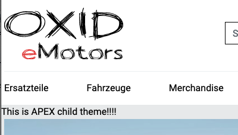

Creating a Child Theme
======================

Besides completely custom themes you can also create child themes that inherit from a parent theme. This gives you the opportunity to modify only the parts you desire to, while the rest stays the same. Please keep in mind that there's only one layer of inheritance with child themes. This means you can extend one installed parent theme with a child but not the child with another child again.

composer.json
-------------

A child theme is an extension like a normal theme, module or component and must be encapsulated in a Composer package. The whole process to generate a Composer installable theme is described in the :doc:`previous section <theme_via_composer>`. We focus on the must-have contents here:

.. code:: json

    {
        "name": "oxid-esales/child",
        "description": "This is a child theme",
        "type": "oxideshop-theme",
        "extra": {
            "oxideshop": {
                "target-directory": "child"
                "assets-directory": "out/child",
            }
        }
    }

We name our child theme simply *child*. The ``type`` stays the same as with a standard theme. As ``target-directory`` we also use our theme's name and the ``assets-directory`` begins with ``out`` followed by the name again. Currently it's just a normal theme installable via Composer.

theme.php
---------

The ``theme.php`` is now where the configuration as a child theme takes place.

.. code:: php

    declare(strict_types=1);

    $aTheme = [
        'id' => 'child',
        'title' => 'CHILD',
        'description' => 'A child theme from APEX.',
        'parentTheme' => 'apex',
        'parentVersions' => ['1.2.0','1.3.0'],
    ];

As ``id``, ``title`` and ``description`` you set the usual things but what's new now are the keys ``parentTheme`` and ``parentVersions``. These two array keys make the theme a child theme.

- ``parentTheme`` is a string and must contain the ``id`` of the parent theme.
- ``parentVersions`` is an array and must contain at least one compatible version of the corresponding parent theme.

In this example we use our current APEX theme and support versions 1.2.0 as well as 1.3.0.

If you wish, you can also add theme setting as usual.

Overwrite Templates
-------------------

To overwrite templates you follow the same structure as the parent theme and simply put the same template into your child theme. Let's say we want to overwrite the template ``header.html.twig``. The APEX (parent) theme follows this structure:

.. code::

    apex
      ├── de
      ├── en
      ├── out
      └── tpl
      .  ├── layout
      .     ├── footer.html.twig
      .     ├── header.html.twig
      .     └── ...
      .  └── ...

This means we must copy the exact same structure in our child theme fot the template ``header.html.twig``:

.. code::

    child
      ├── de
      ├── en
      ├── out
      └── tpl
         └── layout
            └── header.html.twig

If we activate our child theme now, the template ``header.html.twig`` from CHILD is taken while the template ``footer.html.twig`` is still taken from APEX. This means we only copy and modify the templates we desire so.

Example of start.html.twig overwrite
~~~~~~~~~~~~~~~~~~~~~~~~~~~~~~~~~~~~

The child theme's `start.html.twig` template might, for example, get an additional block.

.. _childtheme_template-20240717:

.. code:: twig

    

    
        

            This is APEX child theme!!!!
        

    

    

     ...

The template engine renders the child theme's `start.html.twig` file while using all other templates from the parent theme.

Overwrite Assets
----------------

Overwriting assets follows the same principle. Let's take the image ``logo.svg`` as an example in APEX:

.. code::

    apex
      ├── de
      ├── en
      ├── out
      .  └── apex
      .     └── img
      .        ├── logo.svg
      .        └── ...
      └── tpl

And so we use the same structure for CHILD:

.. code::

    child
      ├── de
      ├── en
      ├── out
      .  └── child
      .     └── img
      .        └── logo.svg
      └── tpl

While ``logo.svg`` is now loading from CHILD all other assets still coming from APEX.

Overwrite Translations
----------------------

Last thing you can overwrite are translations but this time you must use a little bit different structure. The original parent theme uses ``lang.php`` files in corresponding language directories like ``en`` for english or ``de`` for german.

.. code::

    apex
      ├── de
      .  └── lang.php
      ├── en
      .  └── lang.php
      └── ...

You now use the same directory structure again but name the files ``cust_lang.php``.

.. code::

    child
      ├── de
      .  └── cust_lang.php
      ├── en
      .  └── cust_lang.php
      └── ...

Inside the ``cust_lang.php`` files you can change single translations. So the file may contain a few translations like follows:

.. code:: php

    $sLangName = 'English';

    $aLang = [
        'charset' => 'UTF-8'

        'TRUST_BADGES' => 'Our Trust Badges',
        'SOCIAL_MEDIA' => 'Social Platforms',
    ];

.. important::

    If some changes do not take effect directly, take care to update the template cache:

    .. code:: bash

        ./vendor/bin/oe-console oe:cache:clear

.. important::

    If you are in development phase and run ``composer update`` remember to answer the questions to overwrite files in ``source`` with yes. Otherwise your changes from your child theme will not be transfered to ``Application/views`` and ``out`` directory.

Extend a theme via module
-------------------------

All you can achieve with a child theme can also be done with a module. In all OXID eShop Version 7 installations,
module settings fully reside in YAML configuration files, which are much easier to deploy than theme configurations that are
still stored in the database (oxconfig table).

.. note:: With the twig extension mechanism you can only extend existing template blocks.
        Regarding the 'I want to completely exchange a template by child theme' case. That's also possible via module,
        you need to add a module own template and chain extend the shop controller in question using the module's template
        instead of the original theme template.

A module can extend templates for each theme, but we also have a 'one size fits all' approach by using the special directory name `default`.

To learn more about theme extensions for modules, check the following documentation:

* :ref:`extending-existing-templates`
* :ref:`using-twig-in-module-templates`
* :ref:`extending-an-active-theme-block`