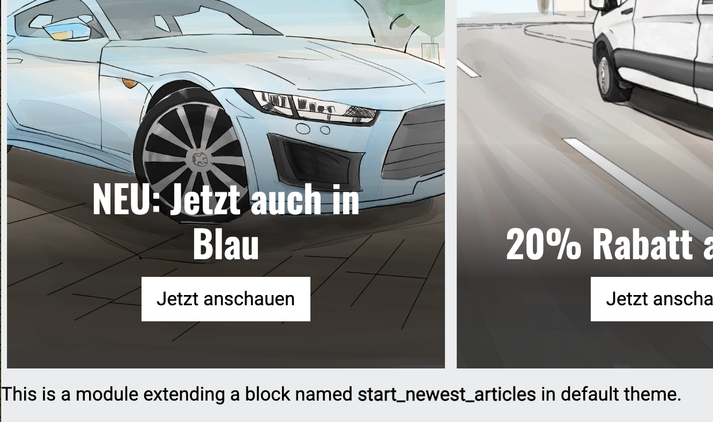
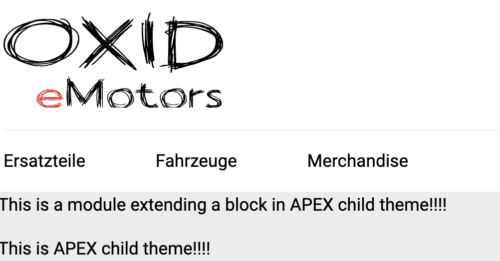
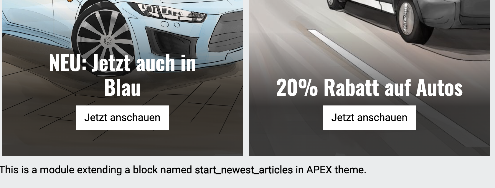

Extend twig compatible theme with a child theme
===============================================

It is possible to create a child theme for and existing (and installed theme) in OXID eShop.
There's only one level of inheritance possible and depending on the use case, it's possible to achieve the same
inheritance results with a module.

We'll show both cases in the following section.

Create a child theme
^^^^^^^^^^^^^^^^^^^^

Create a composer installable child theme of APEX. To mark a theme as a child theme,
add `parentTheme` and `parentVersions` into theme.php as in the following example

.. code:: php

   $aTheme = [
        'id'          => 'apex_child',
        'title'       => 'APEX child',
        'description' => 'APEX child is OXID`s demo child of APEX theme.',
        'thumbnail'   => 'theme.jpg',
        'version'     => '0.0.1',
        'author'      => '<a href="http://www.oxid-esales.com" title="OXID eSales AG">OXID eSales AG</a>',
        'settings'    => [],
        'parentTheme' => 'apex',
        'parentVersions' => ['1.1.0', '1.2.2'],
    ];

For a child theme it's not necessary to copy the complete parent theme, only copy those templates you need to adapt into
the same file structure as the parent theme.

.. code:: bash

        |-- composer.json
        |-- theme.php
         `-- tpl
            `-- page
                `-- shop
                    `-- start.html.twig

The child theme's start.html.twig template might for example get an additional block

.. _childtheme_template-20240717:

.. code:: twig

    

    
        

            This is APEX child theme!!!!
        

    

    

     ...

Resulting in the template engine rendering the child theme's start.html.twig and taking all other templates from the parent theme.

.. image:: ../../../../media/screenshots/twig_child_theme_001.png
   :alt: Twig child theme example
   :height: 228
   :width: 400

Extend a theme via module
^^^^^^^^^^^^^^^^^^^^^^^^^

All you can achieve with a child theme can also be done by a module. In all OXID eShop Version 7, module
settings are fully residing in yaml configuration files which are way easier to deploy than theme configuration which is
still stored in the database (oxconfig table).

.. note:: With the twig extension mechanism you can only extend existing template blocks.
        Regarding the 'I want to completely exchange a template by child theme' case. That's also possible via module,
        you need to add a module own template and chain extend the shop controller in question using the module's template
        instead of the original theme template.

A module can extend templates per theme but we also have a 'one size fits all' way by using the special directory name `default`.

In our first example, the module (when activated) will extend whatever twig compatible theme the shop is using.

.. code:: bash

        .
        |-- composer.json
        |-- metadata.php
        `-- views
            `-- twig
                `-- extensions
                    `-- themes
                        `-- default
                            `-- page
                                `-- shop
                                    `-- start.html.twig

So let's extend blocks in the start page template, where the block named `start_newest_articles` exists in APEX and our APEX child theme.
Block `start_child_theme_block` only exists in the :ref:`child theme template <childtheme_template-20240717>`.

.. code:: twig

    

    
      

          This is a module extending a block in APEX child theme!!!!
      

        {{ parent() }}
    

    
        

            This is a module extending a block named <b>start_newest_articles</b> in default theme.
        

        {{ parent() }}
    

So when APEX theme is active, only the existing block is extended

and when APEX child theme is active, also the child theme's block is extended

To explicitly extend a specific theme, put the to be extended templates into a folder with the theme name, see below.

.. code:: bash

        .
        |-- composer.json
        |-- metadata.php
        `-- views
            `-- twig
                `-- extensions
                    `-- themes
                        |-- apex
                        |   `-- page
                        |       `-- shop
                        |           `-- start.html.twig
                        `-- default
                            `-- page
                                `-- shop
                                    `-- start.html.twig

If you would remove the `default` folder, only APEX theme when active will be extended.
