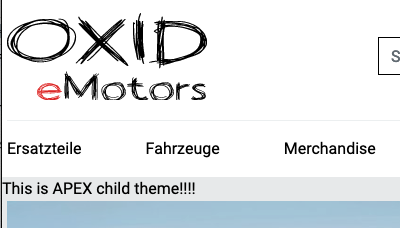

Extend twig compatible theme with a child theme
===============================================

It is possible to create a child theme for and existing (and installed theme) in OXID eShop.
There's only one level of inheritance possible and depending on the use case, it's possible to achieve the same
inheritance results with a module.

We'll show both cases in the following section.

Create a child theme
^^^^^^^^^^^^^^^^^^^^

Create a composer installable child theme of APEX. To mark a theme as a child theme,
add `parentTheme` and `parentVersions` into theme.php as in the following example

.. code:: php

   $aTheme = [
        'id'          => 'apex_child',
        'title'       => 'APEX child',
        'description' => 'APEX child is OXID`s demo child of APEX theme.',
        'thumbnail'   => 'theme.jpg',
        'version'     => '0.0.1',
        'author'      => '<a href="http://www.oxid-esales.com" title="OXID eSales AG">OXID eSales AG</a>',
        'settings'    => [],
        'parentTheme' => 'apex',
        'parentVersions' => ['1.1.0', '1.2.2'],
    ];

For a child theme it's not necessary to copy the complete parent theme, only copy those templates you need to adapt into
the same file structure as the parent theme.

.. code:: bash

        |-- composer.json
        |-- theme.php
         `-- tpl
            `-- page
                `-- shop
                    `-- start.html.twig

The child theme's start.html.twig template might for example get an additional block

.. code:: twig

    

    
        

            This is APEX child theme!!!!
        

    

    

     ...

Resulting in the template engine rendering the child theme's start.html.twig and taking all other templates from the parent theme.

