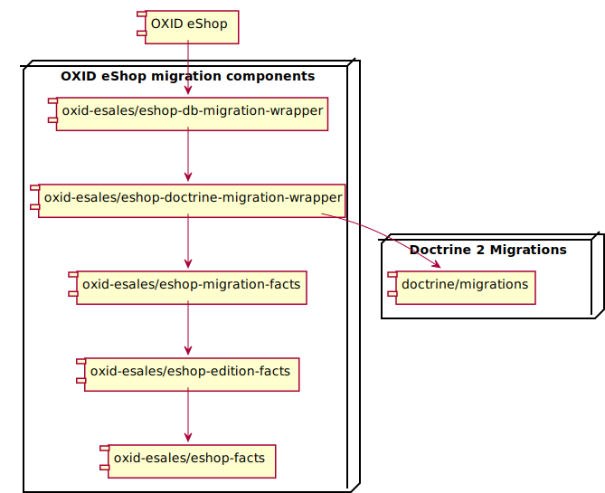

Migrations
==========

OXID eShop uses database migrations for eShop setup and updates. Migration tool can be used for project
specific migrations too.

.. _migrations_infrastructure-20160920:

Infrastructure
--------------

At the moment OXID eShop uses "Doctrine 2 Migrations" and it's integrated via OXID eShop migration components.
Components schema can be found bellow.

OXID tools which are displayed in diagram can be found here:

* https://github.com/OXID-eSales/eshop-db_migration_wrapper
* https://github.com/OXID-eSales/eshop-doctrine_migration_wrapper
* https://github.com/OXID-eSales/eshop-migration_facts
* https://github.com/OXID-eSales/eshop-edition_facts
* https://github.com/OXID-eSales/eshop-facts

Usage
-----

Running migrations
^^^^^^^^^^^^^^^^^^

.. code:: bash

   composer oe:migration:run

This command will run all the migrations which are in OXID eShop specific directories. For example if you have
OXID eShop Enterprise edition, migration tool will run migrations in this order:

* Community Edition migrations
* Professional Edition migrations
* Enterprise Edition migrations
* Project specific migrations

In case you have Community Edition:

* Community Edition migrations
* Project specific migrations

It is also possible to run migrations for specific suite by defining environment variable - **MIGRATION_SUITE**.
This variable defines what type of migration it is. There are 4 types:

* **PR** - For project specific migrations. It should be always used for project development.
* **CE** - Generates migration file for OXID eShop Community Edition. **It's used for product development only**.
* **PE** - Generates migration file for OXID eShop Professional Edition. **It's used for product development only**.
* **EE** - Generates migration file for OXID eShop Enterprise Edition. **It's used for product development only**.

.. note::

   It's possible to overwrite more environment variables. Check OXID eShop migration components documentation which
   is in component repositories. List of component repositories can be found :ref:`here <migrations_infrastructure-20160920>`.

Views creation/regeneration
^^^^^^^^^^^^^^^^^^^^^^^^^^^

.. code:: bash

   composer oe:views:regenerate

This command will create shop views by current eShop version, edition and configuration. It is a good practice to run it right after migrations command.

Generating migrations
^^^^^^^^^^^^^^^^^^^^^

.. code:: bash

   MIGRATION_SUITE=PR composer oe:migration:new

This command will generate new migration. Migration class will be generated to specific directory according **MIGRATION_SUITE**
variable. In this case it will be generated in `source/migration/project_data/` directory.

Running Doctrine 2 Migrations commands
--------------------------------------

Sometimes there will be a need to run doctrine specific commands. For example, you would like to get the list of
doctrine migrations available commands:

.. code:: bash

   MIGRATION_SUITE=PR ./vendor/bin/oe-eshop-facts oe-eshop-doctrine_migration

Or revert to the first migration:

.. code:: bash

   MIGRATION_SUITE=PR ./vendor/bin/oe-eshop-facts oe-eshop-doctrine_migration migrations:migrate first

.. important::

   If **MIGRATION_SUITE** variable will not be defined, command will run through all suites.

More information on how to use Doctrine 2 Migrations can be found in official documentation page:
http://docs.doctrine-project.org/projects/doctrine-migrations/en/latest/
