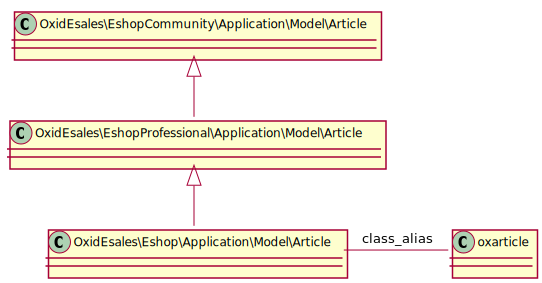
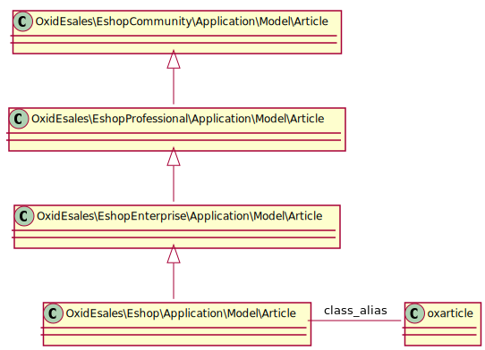
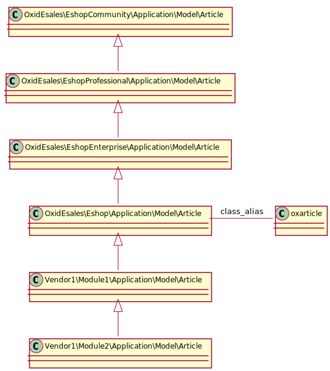

Unified Namespace Classes
=========================

The `Unified Namespace` (``OxidEsales\Eshop``) provides an edition independent namespace for module and core developers.
So disregarding if the shop edition is CE/PE/EE, the `Unified Namespace` class name is to be used in code (core and modules).

Generation of unified namespace classes
---------------------------------------

The component :doc:`unified-namespace-generator <../oxid_components/unified_namespace_generator>` generates the
unified namespace classes on the fly, e.g. when you install or update the OXID eShop.

.. _system_architecture-namespaces-inheritiance_chain:

Inheritance chain of unified namespace classes
----------------------------------------------

Example OXID eShop Professional Edition
^^^^^^^^^^^^^^^^^^^^^^^^^^^^^^^^^^^^^^^

Example OXID eShop Enterprise Edition
^^^^^^^^^^^^^^^^^^^^^^^^^^^^^^^^^^^^^

Example OXID eShop Enterprise Edition with 2 modules activated
^^^^^^^^^^^^^^^^^^^^^^^^^^^^^^^^^^^^^^^^^^^^^^^^^^^^^^^^^^^^^^

.. warning::

   Do NOT use the PHP method ``get_class`` as its return value is dependent on the modules which are currently activated
   in the shop:

   .. code :: php

    // returns Vendor1\Module2\Application\Model\Article in this example
    get_class(oxNew(OxidEsales\Eshop\Application\Model\Article::class));

